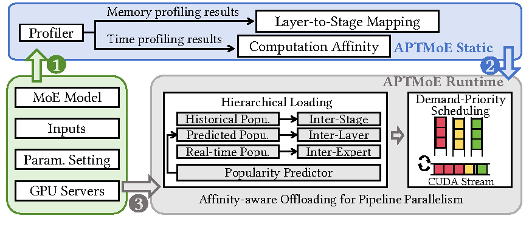
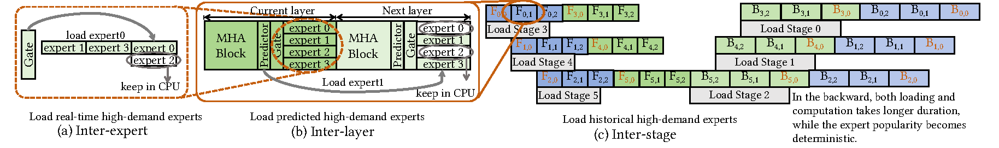

# APTMoE

This is the computational artifact of paper `APTMoE: Affinity-aware Pipeline Tuning for MoE Models on Bandwidth-constrained GPU Nodes`.
This paper presents APTMoE, an affinity-aware pipeline fine-tuning system for MoE models targeting at bandwidth-constrained GPU nodes.
APTMoE enhances the computational efficiency and the model size for fine-tuning MoE modes on limited number of bandwidth-constrained GPU nodes.
APTMoE includes the affinity-aware offloading technique to enhance the pipeline parallelism, with the key idea to offload a portion of the affinity computation to the CPU, so as to better manage data across heterogeneous memory. 
Our contributions are summarized as follows:

- **The hierarchical loading strategy**. With the prior knowledge of expert popularity and computation affinity, it employs three loading phases to greedily allocate computation with the highest affinity and minimize data movement volume.
- **The demand-priority scheduling strategy**. It is used to alleviate the mutual interference among loading phases and maximize the bandwidth utilization by dynamically coordinating the loading order.
- **Expert popularity simulator for evaluation**. It proxies the gate and predictor for both generalized and real MoE models, so as to evaluate APTMoE on fine-tuning MoE models.

## Overview
APTMoE system can be divided into two parts: the static part and the runtime part. The workflow of APTMoE is as follows:
<br><div id="top" align="center">

</div><br>

- **The static part** profiles memory usage and execution time, and generates the layer-to-stage mapping and execution time lookup table.
- **The runtime part** takes the affinity-aware offloading, which includes the hierarchical loading strategy and the demand-priority scheduling strategy, to enhance
the pipeline parallelism on bandwidth-constrained GPU nodes. 

The hierarchical loading strategy subdivides the previous inter-stage loading into three phases, namely inter-stage loading, inter-layer loading and inter-expert loading. The three loading phases of the hierarchical loading strategy are as follows:
<br><div id="top" align="center">

</div><br>


## Environment Setup
### Hardware
We conduct all these experiments on a cluster with 4 nodes.
Each node contains 8 NVIDIA A800 GPUs (40GB) and every four of them connect to a Intel Xeon Gold 6348 CPU with 28 cores.
Each node has a total of 1024 GB main memory.
The inter-node interconnect is InfiniBand HDR 100 Gbps, and the intra-node interconnect is PCIe.

### Software
- Pytorch 2.0.0+cu117
- numpy 1.26.4
- transformers 4.37.0
- psutil 5.9.8


## Evaluation
The evaluation of APTMoE can be divided into two parts: generalized case study and real case study.

### Generalized case study
For generalized case study, we establish MoE models with varying model sizes to conduct performance evaluation, incorporating a simulator for simulating different expert popularity. We simulate the expert popularity and use the dummy data.
The execution command of the demo of one generalized case is as followed:

```bash
CUDA_VISIBLE_DEVICES=0,1,2,3 torchrun  --nproc_per_node 4 ./main.py --is_moe=True --num_training_steps=50 --model_config=S --num_experts=16 --gini=0.3 --topo=C1+G2 --pipeline=APTMoE
```

The meaning of hyper-parameters:
```bash
  --batch_size BATCH_SIZE
                        batch size
  --num_chunks NUM_CHUNKS
                        mumber of micro batches
  --seq_length SEQ_LENGTH
                        sequence length
  --seed SEED           random seed
  --num_layers NUM_LAYERS
                        number of Transformer layers in the whole model
  --num_stages NUM_STAGES
                        number of stages in the pipeline
  --embedding_dim EMBEDDING_DIM
                        embedding dimension in a Transformer layer
  --hidden_dim HIDDEN_DIM
                        hidden dimension in a Transformer layer
  --num_warmup_steps NUM_WARMUP_STEPS
                        number of iterations to warm up before training
  --num_training_steps NUM_TRAINING_STEPS
                        number of iterations to time in experiment
  --num_heads NUM_HEADS
                        number of attention heads per layer
  --num_experts NUM_EXPERTS
                        num experts per layer
  --pipeline {GPipe,GPipeOffload,Mobius,APTMoE}
                        pipeline parallelism approach
  --model_config {S,M,L}
                        model configuration
  --is_moe IS_MOE       whether to use MoE models
  --fwd_only            Only perform forward pass (three loading phases)
  --inter_stage_only    Only perform inter-stage phase
  --gini GINI           expert workload imbalance degree
  --topo {C1+G1,C1+G2,C1+G4}
                        device topology

```


This demo utilizes the time information from our previous profile as the basis for the hierarchical loading strategy, and the performance may vary on the machine you are using. The throughput of each evaluation is related to a specific model configuration(e.g. MoE-S-16), hardware configuration(e.g. C1+G2) and expert popularity(e.g. G=0.3). 

### Real case study
For the real case study, we take traces from fine-tuning NLLB-MoE and Mixtral-8x7B models on APP dataset.
After collecting the results of the expert gating process, we hack the `transformers` library and train the predictor gate.

In details, the modified files in the `transformers` library are:

- `./transformers/src/transformers/models/mixtral/modeling_mixtral.py`
- `./transformers/src/transformers/models/nllb_moe/modeling_nllb_moe.py`

```bash
pip install ./transformers
```
We make data for training the predictor using the following demand:

```
# Making data (Get model weights and data before)
python mkdata_mixtral.py
# or
python mkdata_nllb.py
```
Train the predictor:

```
# Training
python pregate_mixtral.py
# or
python pregate_nllb.py
```

This part will produce expert popularity generated from both predictor and gate throughout all iterations. Also, it reports the predictor accuracy.